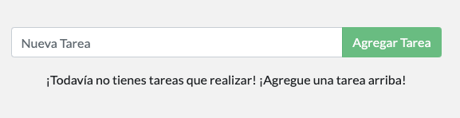

# Actualizar el código fuente de la aplicación

Como una pequeña petición de funcionalidad, el equipo de producto nos ha pedido que cambiemos el "texto vacío" cuando no tenemos ningún elemento de la lista de tareas pendientes. Les gustaría hacer la transición a lo siguiente:

> ¡Todavía no tienes tareas que realizar! ¡Agregue una tarea arriba!

Bastante simple, ¿verdad? Hagamos el cambio.

### Actualizando nuestro Código Fuente <a id="actualizando-nuestro-codigo-fuente"></a>

1. En el archivo `~/app/src/static/js/app.js`, actualice la línea 56 para usar el nuevo texto



```markup
[ELIMINAR] <p className="text-center">No hay tareas todavía! Agrega una abajo!</p>
[AGREGAR ] <p className="text-center">¡Todavía no tienes tareas que realizar! ¡Agregue una tarea arriba!</p>

```



2. Vamos a construir nuestra versión actualizada de la imagen, usando el mismo comando que usamos antes.

```bash
docker build -t infraestructura-101 .
```

3. Iniciemos un nuevo contenedor usando el código actualizado.

```bash
docker run -dp 3000:3000 infraestructura-101
```

**Ops!** Probablemente has visto un error como este \(los identificaciones serán diferentes\):

```bash
docker: Error response from daemon: driver failed programming external connectivity on endpoint laughing_burnell 
(bb242b2ca4d67eba76e79474fb36bb5125708ebdabd7f45c8eaf16caaabde9dd): Bind for 0.0.0.0:3000 failed: port is already allocated.
```

Entonces, ¿qué pasó? No podemos iniciar el nuevo contenedor porque el anterior aún está en funcionamiento. La razón por la que esto es un problema es porque ese contenedor está usando el puerto 3000 del host y sólo un proceso \(contenedores incluidos\) puede escuchar a un puerto específico. Para arreglar esto, necesitamos eliminar el contenedor obsoleto.

### Reemplazando nuestro contenedor obsoleto <a id="reemplazando-nuestro-contenedor-obsoleto"></a>

Para eliminar un contenedor, primero hay que detenerlo. Luego, puede ser eliminado.

1. Obtenga el ID del contenedor usando el comando `docker ps`

```bash
docker ps
```

2. Utilice el comando `docker stop` para detener el contenedor.

```bash
# Intercambiar <el-identificador-del-contenedor> con el ID del docker ps
docker stop <el-identificador-del-contenedor>
```

3. Una vez que el contenedor se ha detenido, puede eliminarlo utilizando el comando `docker rm`

```bash
docker rm <el-identificador-del-contenedor> 
```

4. Ahora, inicia tu aplicación actualizada.

```bash
docker run -dp 3000:3000 infraestructura-101
```

 Abre la aplicación y verás tu texto de ayuda actualizado!




**Consejo**

Puede detener y eliminar un contenedor con un solo comando añadiendo el parámetro "-f"  \(significa force\) al comando**`docker rm`** Por ejemplo: **`docker rm -f <el-identificador-del-contenedor>`**


### Recapitulación

Aunque hemos podido crear una actualización, hay dos cosas que puede que hayas notado:

* Todos las tareas existentes en nuestra lista de tareas por hacer han desaparecido! Esa no es una buena experiencia de usuario! Hablaremos de eso pronto.
* Había _muchos_ pasos involucrados para un cambio tan pequeño. En la próxima sección, hablaremos sobre cómo ver las actualizaciones de código sin necesidad de reconstruir y comenzar un nuevo contenedor cada vez que hagamos un cambio.

