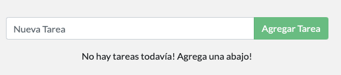

# Construcción de imágen

Para construir la aplicación, necesitamos usar un `Dockerfile`. Un Dockerfile es simplemente un script de instrucciones basado en texto que se utiliza para crear una imagen de contenedor. Si ya ha creado Dockerfiles anteriormente, es posible que aparezcan algunos defectos en el Dockerfile que se muestra a continuación. Pero, ¡no te preocupes! Los revisaremos.

1. Cree un archivo llamado Dockerfile con el siguiente contenido.

```text
FROM node:10-alpine
WORKDIR /app
COPY . .
RUN yarn install --production
CMD ["node", "/app/src/index.js"]
```

 2. Construya la imagen del contenedor usando el comando `docker build`

```text
docker build -t infraestructura-101 .
```

Notarás que se están usando algunos parámetros. Aquí hay más información sobre ellos:

* `-t`  - Nombre y opcionalmente una etiqueta en el formato 'imágen:tag'.
* `.` - Indica que el directorio en el que se debe compilar la imagen es el mismo en el que se está ejecutando el comando docker build

Este comando usó el Dockerfile para construir una nueva imagen del contenedor. Puede que haya notado que se han descargado muchas "capas". Esto se debe a que instruimos al constructor que queríamos empezar desde la imagen `node:10-alpine`. Pero, como no teníamos esa imagen en nuestra máquina, necesitaba ser descargada.

Después de eso, copiamos en nuestra aplicación y usamos `yarn` para instalar las dependencias de nuestra aplicación. La directiva `CMD` especifica el comando por defecto que se ejecutará al iniciar un contenedor desde esta imagen.

### Iniciando el contenedor de la aplicación <a id="iniciando-el-contenedor-de-la-aplicacion"></a>

Ahora que tenemos una imagen, vamos a ejecutar la aplicación! Para ello, usaremos el comando `docker run` \(¿recuerdas lo de antes?\).

1. Inicie su contenedor usando el comando `docker run`:

```text
docker run -dp 3000:3000 infraestructura-101
```

¿Recuerdas los parámetros  `-d` y `-p`? Estamos ejecutando el nuevo contenedor en modo "separado" \(en segundo plano\) y creando un mapeo entre el puerto 3000 del host y el puerto 3000 del contenedor.

2. Abra la aplicación en su navegador web visitando [http://localhost:3000](http://localhost:3000) . Una vez abierto, ¡debería tener una lista de tareas por hacer vacía!



3. Adelante, agregue una o dos tareas y vea que funciona como usted espera. Puede marcar las tareas como completadas y eliminarlas.

En este punto, deberías tener un administrador de listas de tareas por hacer con unos cuantos elementos, ¡todos construidos por ti! Ahora, hagamos algunos cambios y aprendamos sobre el manejo de nuestros contenedores.

### Recapitulación

En esta breve sección, aprendimos lo básico sobre la construcción de una imagen de contenedor y creamos un Dockerfile para hacerlo. Una vez que construimos una imagen, iniciamos el contenedor y ¡vimos la aplicación en ejecución!

A continuación, vamos a hacer una modificación a nuestra aplicación y aprender a actualizar nuestra aplicación en ejecución con una nueva imagen. En el camino, aprenderemos algunos otros comandos útiles.

