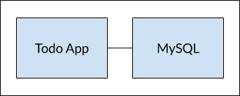

# Networking

Hasta este punto, hemos estado trabajando con aplicaciones de contenedores individuales. Pero, ahora queremos añadir MySQL a la pila de aplicaciones. A menudo se plantea la siguiente pregunta: "¿Dónde se ejecutará MySQL? ¿Instalarlo en el mismo contenedor o ejecutarlo por separado?" En general, **cada contenedor debe hacer una cosa y debe hacerlo bien.** Algunas razones:

* Es muy probable que tenga que escalar las API y los interfaces de usuario de forma diferente a las bases de datos.
* Los contenedores separados le permiten versionar y actualizar versiones de forma aislada.
* Si bien puede utilizar un contenedor para la base de datos localmente, es posible que desee utilizar un servicio gestionado para la base de datos en producción. Por esta razón no sería buena idea enviar su motor de base de datos con su aplicación.
* La ejecución de múltiples procesos requerirá un gestor de procesos \(el contenedor sólo inicia un proceso\), lo que añade complejidad al inicio/parada del contenedor.

Y hay más razones. Por lo tanto, actualizaremos nuestra aplicación para que funcione así



### Redes de Contenedores <a id="redes-de-contenedores"></a>

Recuerde que los contenedores, por defecto, se ejecutan de forma aislada y no saben nada sobre otros procesos o contenedores en la misma máquina. Entonces, ¿cómo permitimos que un contenedor hable con otro? La respuesta es **networking**. Ahora, usted no tiene que ser un ingeniero de redes \(¡hurra!\). Simplemente recuerde esta regla...

> Si dos contenedores están en la misma red, pueden hablar entre sí. Si no están en la misma red, no pueden.

### Inicio de MySQL <a id="inicio-de-mysql"></a>

Hay dos maneras de poner un contenedor en una red:

1. Asignándole la red al lanzar el contenedor
2. Conectándolo a un contenedor existente

Por ahora, primero crearemos la red y asignaremos el contenedor MySQL al inicio.

1. Crear la red

```bash
docker network create todo-app
```

2. Inicie un contenedor MySQL y conéctelo a la red. También vamos a definir algunas variables de entorno que la base de datos utilizará para inicializar la base de datos \(ver la sección "Variables de entorno" en la sección [MySQL Docker Hub listing](https://hub.docker.com/_/mysql/)\).

```bash
docker run -d \
    --network todo-app --network-alias mysql \
    -v todo-mysql-data:/var/lib/mysql \
    -e MYSQL_ROOT_PASSWORD=secret \
    -e MYSQL_DATABASE=todos \
    mysql:5.7
```

También verás que especificamos la bandera `--network-alias`. Volveremos a eso en un momento.


**Información**

Notarás que estamos usando un volumen llamado `todo-mysql-data` aquí y lo estamos montando en `/var/lib/mysql`, que es donde MySQL almacena sus datos. Sin embargo, nunca ejecutamos un comando `docker volume create`. Docker reconoce que queremos usar un volumen con nombre y lo crea automáticamente para nosotros.


3. Para confirmar que tenemos la base de datos en funcionamiento, conéctese a la base de datos y verifique que se conecte.

```bash
docker exec -it <mysql-container-id> mysql -p
```

Cuando aparezca el mensaje de contraseña, escriba **secret**. En el intérprete de comandos MySQL, haga una lista de las bases de datos y verifique que vea la base de datos `todos`.

```bash
mysql> SHOW DATABASES;
```

Debería ver en la salida algo así:

```text
+--------------------+
| Database           |
+--------------------+
| information_schema |
| mysql              |
| performance_schema |
| sys                |
| todos              |
+--------------------+
5 rows in set (0.00 sec)
```

¡Hurra! Tenemos nuestra base de datos de "**todos**" y está lista para que la utilicemos!

### Ejecutando nuestra aplicación con MySQL <a id="ejecutando-nuestra-aplicacion-con-mysql"></a>

La aplicación todo soporta la configuración de algunas variables de entorno para especificar la configuración de la conexión MySQL. Estas variables de entorno son:

* `MYSQL_HOST` - el nombre de host para el servidor MySQL en ejecución
* `MYSQL_USER` - el nombre de usuario que se utilizará para la conexión
* `MYSQL_PASSWORD` - la contraseña a utilizar para la conexión
* `MYSQL_DB` - la base de datos a utilizar una vez conectada


**Advertencia**

Mientras que el uso de **ENV** vars para establecer los ajustes de conexión es generalmente aceptable para el desarrollo, es **ALTAMENTE DESCARTADO** cuando se ejecutan aplicaciones en producción. Diogo Mónica, antiguo jefe de seguridad de Docker, [escribió una fantástica entrada en el blog](https://diogomonica.com/2017/03/27/why-you-shouldnt-use-env-variables-for-secret-data/) explicando lo antes mencionado.

Un mecanismo más seguro es utilizar el soporte secreto proporcionado por su estructura de orquestación de contenedores. En la mayoría de los casos, estos secretos se montan como archivos en el contenedor en ejecución. Verás muchas aplicaciones \(incluyendo la imagen MySQL y la aplicación todo\) que también soportan env vars con un sufijo `_FILE` para apuntar a un archivo que contiene el archivo.

Por ejemplo, si establece `MYSQL_PASSWORD_FILE` var, la aplicación utilizará el contenido del archivo referenciado como contraseña de conexión. Docker no hace nada para apoyar a estos equipos. Su aplicación necesitará saber cómo buscar la variable y obtener el contenido del archivo.


Con todo esto explicado, ¡empecemos nuestro contenedor!

1. Especificaremos cada una de las variables de entorno anteriores y conectaremos el contenedor a nuestra red de aplicaciones.

```bash
docker run -dp 3000:3000 \
  -w /app -v $PWD:/app \
  --network todo-app \
  -e MYSQL_HOST=mysql \
  -e MYSQL_USER=root \
  -e MYSQL_PASSWORD=secret \
  -e MYSQL_DB=todos \
  node:10-alpine \
  sh -c "yarn install && yarn run dev"
```

2. Si miramos los registros del contenedor \(`docker logs <container-id>`\), veremos un mensaje indicando que está usando la base de datos mysql.

```bash
# Previous log messages omitted
$ nodemon src/index.js
[nodemon] 1.19.2
[nodemon] to restart at any time, enter `rs`
[nodemon] watching dir(s): *.*
[nodemon] starting `node src/index.js`
Connected to mysql db at host mysql
Listening on port 3000
```

3. Abre la aplicación en tu navegador y añade algunos elementos a tu lista de tareas.

4. Conéctese a la base de datos mysql y compruebe que los elementos se están escribiendo en la base de datos. Recuerde, la contraseña es **secret**.

```bash
docker exec -ti <mysql-container-id> mysql -p todos
```

Y en la consola de MySQL, ejecuta lo siguiente:

```bash
mysql> select * from todo_items;
+--------------------------------------+--------------------+-----------+
| id                                   | name               | completed |
+--------------------------------------+--------------------+-----------+
| c906ff08-60e6-44e6-8f49-ed56a0853e85 | Do amazing things! |         0 |
| 2912a79e-8486-4bc3-a4c5-460793a575ab | Be awesome!        |         0 |
+--------------------------------------+--------------------+-----------+
```

Obviamente, su tabla se verá diferente porque tiene sus propios items. Entonces, ¡deberías verlos almacenados allí!

### Recapitulación <a id="recapitulacion"></a>

En este punto, tenemos una aplicación que ahora almacena sus datos en una base de datos externa que se ejecuta en un contenedor separado. Aprendimos un poco sobre redes de contenedores y vimos cómo se puede realizar la detección de servicios utilizando DNS.

Pero, hay una buena posibilidad de que se esté empezando a sentir un poco abrumado con todo lo que necesita hacer para iniciar esta aplicación. Tenemos que crear una red, iniciar contenedores, especificar todas las variables de entorno, exponer puertos, y mucho más! Eso es mucho para recordar y ciertamente está haciendo que las cosas sean más difíciles de pasar a otra persona.

En la siguiente sección, hablaremos sobre Docker Compose. Con Docker Compose, podemos compartir nuestras pilas de aplicaciones de una forma mucho más fácil y dejar que otros las ejecuten con un único \(y simple\) comando!

