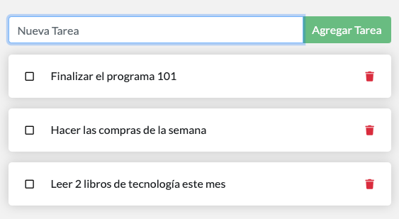

# Primeros Pasos

### Iniciando un contenedor

Vamos a lanzar nuestro contenedor y luego vamos a ir explicando paso a paso que significa el comando y sus parámetros; manos a la obra!, abre tu terminal y ejecuta el siguiente comando

```bash
docker run -d -p 80:80 dockersamples/101-tutorial:es
```

Felicitaciones! Ha iniciado el contenedor para este tutorial! Primero vamos a explicar el comando que acabas de ejecutar.

Notarás que se están usando algunos parámetros. Aquí hay más información sobre ellos:

* `-d` - ejecuta el contenedor en modo independiente \(tarea de fondo o segundo plano\).
* `-p 80:80` - asigna el puerto 80 del host al puerto 80 del contenedor
* `dockersamples/101-tutorial` - la imagen a utilizar para el contenedor
* `:es` - Aunque no es estrictamente un medio para identificar un contenedor, esto nos permite  especificar una versión de una imagen con la que te gustaría ejecutar el contenedor `imagen[:versión]` en este caso vamos a usar la versión español


**Consejo**

Puede combinar parámetros de un solo carácter para acortar el comando completo. Por ejemplo, el comando anterior podría escribirse como:

```bash
docker run -dp 80:80 dockersamples/101-tutorial:es
```


### ¿Qué es un contenedor? <a id="que-es-un-contenedor"></a>

Ahora que ha ejecutado un contenedor, ¿qué es un contenedor? En pocas palabras, un contenedor es simplemente otro proceso en su máquina que ha sido aislado de todos los demás procesos en la máquina anfitriona \(máquina host\). Ese aislamiento aprovecha [namespaces del kernel y cgroups](https://medium.com/@saschagrunert/demystifying-containers-part-i-kernel-space-2c53d6979504), características que han estado en Linux durante mucho tiempo. En taller usamos la herramienta Docker la cual ha trabajado para que estas capacidades sean accesibles y fáciles de usar.

### ¿Qué es una imagen de contenedor? <a id="que-es-una-imagen-de-contenedor"></a>

Cuando se ejecuta un contenedor, utiliza un sistema de archivos aislado. Este sistema de archivos personalizado es proporcionado por una **imagen del contenedor**. Dado que la imagen contiene el sistema de archivos del contenedor, debe contener todo lo necesario para ejecutar una aplicación: todas las dependencias, configuración, scripts, binarios, etc. La imagen también contiene otra configuración para el contenedor, como variables de entorno, un comando predeterminado para ejecutar y otros metadatos.


**Información**

Si está familiarizado con **`chroot`**, piense en un contenedor como una versión extendida de **`chroot`**. El sistema de archivos simplemente viene de la imagen. Pero, un contenedor añade un aislamiento adicional que no está disponible cuando se usa simplemente chroot.


### Nuestra aplicación

Para el resto de este tutorial, trabajaremos con un simple gestor de listas de tareas \(todo list\) que se está ejecutando en NodeJS. Si no estás familiarizado con NodeJS, ¡no te preocupes! ¡No se necesita experiencia real con JavaScript!

En este punto, su equipo de desarrollo es bastante pequeño y usted simplemente está construyendo una aplicación para probar su MVP \(Producto Mínimo Viable\). Quieres mostrar cómo funciona y lo que es capaz de hacer sin necesidad de pensar en cómo funcionará para un equipo grande, múltiples desarrolladores, etc.



### Obteniendo la aplicación <a id="introduciendo-nuestra-aplicacion-en-pwd"></a>

Antes de que podamos ejecutar la aplicación, necesitamos obtener el código fuente, para ello vamos a clonar el siguiente repositorio de GitHub [todo-list](https://github.com/herrera-luis/todo-list) con el siguiente comando:

```bash
git clone https://github.com/herrera-luis/todo-list.git
```

Cambie su directorio de trabajo actual a la nueva carpeta 'todo-list'.

```bash
cd todo-list/
```

En este directorio, debería ver una aplicación simple basada en NodeJS.

```bash
ls
Dockerfile   Makefile   README.md   package.json   spec/   src/  yarn.lock
```

### Recapitulación

En esta sección vimos conceptos generales de los contenedores y también ejecutamos uno, además obtuvimos el código fuente de la aplicación que vamos a utilizar en los siguientes módulos de contenerización. Más adelante nos adentraremos más en las imágenes, cubriendo temas como las capas, buenas prácticas y mucho más.

