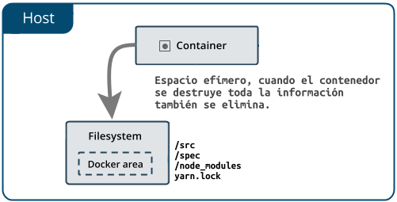
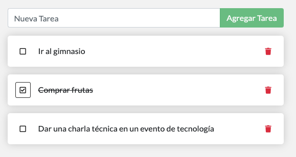

# Volúmenes

### Persistiendo nuestra base de datos

En caso de que no lo hayas notado, nuestra lista de cosas por hacer está siendo limpiada cada vez que lanzamos el contenedor. ¿Por qué sucede esto? Vamos a ver cómo funciona el contenedor.

### El sistema de archivos del contenedor <a id="el-sistema-de-archivos-del-contenedor"></a>

Cuando un contenedor se ejecuta, utiliza las diferentes capas de una imagen para su sistema de archivos. Cada contenedor también tiene su propio "espacio" para crear/actualizar/quitar archivos. Cualquier cambio no se verá en otro contenedor, _incluso si_ están usando la misma imagen.



### Volúmenes de Contenedores <a id="volumenes-de-contenedores"></a>

Los contenedores pueden crear, actualizar y eliminar archivos, esos cambios se pierden cuando se destruye el contenedor. Con los volúmenes, podemos cambiar todo esto.

[Volúmenes](https://docs.docker.com/storage/volumes/) proporcionan la capacidad de conectar rutas específicas del sistema de archivos del contenedor de nuevo a la máquina anfitriona. Si se monta un directorio en el contenedor, los cambios en ese directorio también se ven en el equipo host. Si montamos ese mismo directorio en los reinicios del contenedor, veremos los mismos archivos.

Hay dos tipos principales de volúmenes. Eventualmente usaremos ambos, pero empezaremos con **volúmenes nombrados**.

### Persistiendo datos de nuestro Gestor de Tareas \(todo-list\) <a id="persistiendo-datos-de-nuestro-gestor-de-tareas-todo-app"></a>

Por defecto, la aplicación "todo-list" almacena sus datos en un archivo de base de datos [SQLite](https://www.sqlite.org/index.html) en `/etc/todos/todo.db`. Si no estás familiarizado con SQLite, ¡no te preocupes! Es simplemente una base de datos relacional en la que todos los datos se almacenan en un único archivo. Aunque esto no es lo mejor para aplicaciones a gran escala, funciona para pequeñas demostraciones. Hablaremos de cambiar esto a un motor de base de datos real más tarde.

Con la base de datos siendo un solo archivo, si podemos mantener ese archivo en el host y ponerlo a disposición del siguiente contenedor, debería ser capaz de retomarlo donde lo dejó el último. Creando un volumen y adjuntándolo \(a menudo llamado "montaje"\) al directorio en el que se almacenan los datos, podemos persistir en los datos. Mientras nuestro contenedor escribe en el archivo `todo.db`, persistirá en el host del volumen.

Como se mencionó anteriormente, vamos a usar un **volumen nombrado**. Piense en un volumen nombrado como un simple cubo de datos. Docker mantiene la ubicación física en el disco y sólo necesita recordar el nombre del volumen. Cada vez que utilice el volumen, Docker se asegurará de que se proporcionen los datos correctos.

1. Cree un volumen utilizando el comando `docker volume create`.

```bash
docker volume create todo-db
```

2. Inicie el contenedor `infraestructura-101` \(recuerde que hay que eliminar primero el que está corriendo\), pero añada el indicador `-v` para especificar un montaje de volumen. Usaremos el volumen nombrado y lo montaremos en `/etc/todos`, que capturará todos los archivos creados en la ruta.

```text
docker run -dp 3000:3000 -v todo-db:/etc/todos infraestructura-101
```

3. Una vez que el contenedor se inicie, abra la aplicación y añade algunas tareas a su lista de tareas pendientes.



4. Proceda a eliminar el contenedor `infraestructura-101`. Utilice `docker ps` para obtener el ID y luego `docker rm -f <id-del-contendor>` para eliminarlo.

5. Inicie un nuevo contenedor usando el mismo comando del paso 2.

6. Abra la aplicación. Usted debe ver sus tareas todavía en su lista

7. Adelante, proceda a eliminar el contenedor cuando haya terminado de revisar su lista

¡Genial! ¡Ahora ha aprendido a persistir los datos de su aplicación!


**Consejo**

Aunque los volúmenes nombrados y bind mounts \(de los que hablaremos en un minuto\) son los dos tipos principales de volúmenes soportados por una instalación de motor Docker predeterminada, hay muchos plugins de controladores de volumen disponibles para soportar NFS, SFTP, NetApp y mucho más. Esto será especialmente importante una vez que comience a ejecutar contenedores en múltiples hosts en un entorno agrupado con Swarm, Kubernetes, etc.


### Sumérjase en nuestro Volumen <a id="sumerjase-en-nuestro-volumen"></a>

Mucha gente se pregunta con frecuencia "¿Dónde está Docker _actualmente_ almacenando mis datos cuando uso un volumen nombrado?" Si quiere saber, puede usar el comando `docker volume inspect`

```yaml
docker volume inspect todo-db
[
    {
        "CreatedAt": "2020-02-09T21:37:36Z",
        "Driver": "local",
        "Labels": {},
        "Mountpoint": "/var/lib/docker/volumes/todo-db/_data",
        "Name": "todo-db",
        "Options": {},
        "Scope": "local"
    }
]
```

El `Mountpoint` es la ubicación real en el disco donde se almacenan los datos. Tenga en cuenta que en la mayoría de los equipos, necesitará tener acceso de root para acceder a este directorio desde el host. Pero, ahí es donde está

### Recapitulación <a id="recapitulacion"></a>

En este punto, tenemos una aplicación en funcionamiento que puede sobrevivir a los reinicios. ¡Podemos mostrarlo a nuestros inversores y esperar que puedan captar nuestra visión!

Sin embargo, vimos anteriormente que la reconstrucción de imágenes para cada cambio toma bastante tiempo. Tiene que haber una forma mejor de hacer cambios, ¿verdad? Con el uso de `bind mounts` \(que ya hemos mencionado anteriormente\), ¡hay una forma mejor de hacerlo! Echemos un vistazo a eso ahora!

