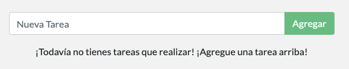

# Usando Bind Mounts

En el capítulo anterior, hablamos y usamos un **volúmenes nombrados** para mantener los datos en nuestra base de datos. Los volúmenes nombrados son excelentes si simplemente queremos almacenar datos, ya que no tenemos que preocuparnos por _donde_ se almacenan los datos.

Con **bind mounts**, controlamos el punto de montaje exacto en el host. Podemos utilizar esto para persistir en los datos, pero a menudo se utiliza para proporcionar datos adicionales en contenedores. Cuando trabajamos en una aplicación, podemos usar bind mount para montar nuestro código fuente en el contenedor para que vea los cambios de código, responda y nos permita ver los cambios de inmediato.

Para aplicaciones basadas en NodeJS, [nodemon](https://npmjs.com/package/nodemon) es una gran herramienta para observar los cambios en los archivos y luego reiniciar la aplicación. Existen herramientas equivalentes en la mayoría de los demás lenguajes y frameworks.

### Comparaciones rápidas de tipos de volumen <a id="comparaciones-rapidas-de-tipos-de-volumen"></a>

Bind mounts y volúmenes nombrados son los dos tipos principales de volúmenes que vienen con el motor Docker. Sin embargo, hay controladores de volumen adicionales disponibles para soportar otros casos de uso. \([SFTP](https://github.com/vieux/docker-volume-sshfs), [Ceph](https://ceph.com/geen-categorie/getting-started-with-the-docker-rbd-volume-plugin/), [NetApp](https://netappdvp.readthedocs.io/en/stable/), [S3](https://github.com/elementar/docker-s3-volume), y más\).

|  | Volúmenes Nombrados | Bind Mounts |
| :--- | :--- | :--- |
| Ubicación del Anfitrión \(Host\) | Docker escoge | Usted controla |
| Ejemplo de Mount \(usando `-v`\) | volumen:/usr/local/data | /path/to/data:/usr/local/data |
| Llena el nuevo volumen con el contenido del contenedor | Si | No |
| Soporta controladores de volumen | Si | No |

### Inicio de un contenedor modo desarrollo <a id="inicio-de-un-contenedor-modo-dev"></a>

Para ejecutar nuestro contenedor para soportar un flujo de trabajo de desarrollo, haremos lo siguiente:

* Montar nuestro código fuente en el contenedor
* Instalar todas las dependencias, incluyendo las dependencias "dev".
* Iniciar nodemon para observar los cambios en el sistema de archivos

Así que, ¡hagámoslo!

1. Asegúrese de no tener ningún contenedor `infraestructura-101` en funcionamiento.

2. Ejecute el siguiente comando. Le explicaremos lo que pasa después:

```bash
docker run -dp 3000:3000 \
    -w /app -v $PWD:/app \
    node:10-alpine \
    sh -c "yarn install && yarn run dev"
```

* `-dp 3000:3000` - igual que antes. Ejecutar en modo independiente \(en segundo plano\) y crear una asignación de puertos
* `-w /app` - establece el "directorio de trabajo" o el directorio actual desde el que se ejecutará el comando
* `-v $PWD:/app`- realiza el montaje de volumen en donde  `$PWD`significa el directorio en donde se está ejecutando el comando y `:/app`el destino a donde van a ir mis datos dentro del contenedor
* `node:10-alpine` - la imagen a utilizar. Tenga en cuenta que esta es la imagen base de nuestra aplicación desde el Dockerfile
* `sh -c "yarn install && yarn run dev"` - el comando. Estamos iniciando una shell usando `sh` \(alpine no tiene `bash`\) y ejecutando `yarn install` para instalar _todas las_ dependencias y luego ejecutando `yarn run dev`. Si miramos en el `package.json`, veremos que el script `dev` está empezando `nodemon`.

3. Puede ver los registros usando `docker logs -f <id-del-contenedor>`

```bash
docker logs -f <container-id>
$ nodemon src/index.js
[nodemon] 1.19.2
[nodemon] to restart at any time, enter `rs`
[nodemon] watching dir(s): *.*
[nodemon] starting `node src/index.js`
Using sqlite database at /etc/todos/todo.db
Listening on port 3000
```

Cuando termine de ver los registros, salga pulsando `Ctrl`+`C`

4. Ahora, hagamos un cambio en la aplicación. En el archivo `src/static/js/app.js`, cambiemos el botón "Agregar Tarea" para decir simplemente "Agregar". Este cambio será en la línea 109. 



```javascript
[ELIMINAR] {submitting ? 'Adding...' : 'Agregar Tarea'}
[AGREGAR ] {submitting ? 'Adding...' : 'Agregar'}
```



5. Simplemente actualice la página \(o ábrala\) y verá el cambio reflejado en el navegador casi inmediatamente. El servidor de NodeJS puede tardar unos segundos en reiniciarse, así que si obtiene un error, intente actualizarlo después de unos segundos.



6. Siéntase libre de hacer cualquier otro cambio que desee hacer. Cuando haya terminado, detenga el contenedor y cree su nueva imagen usando `docker build -t infraestructura-101 .`

El uso de bind mounts es _muy_ común en las configuraciones de desarrollo local. La ventaja es que la máquina de desarrollo no necesita tener todas las herramientas de construcción y entornos instalados. Con un solo comando `docker run`, el entorno de desarrollo se levanta y está listo para funcionar. Hablaremos de Docker Compose en un futuro, ya que esto nos ayudará a simplificar nuestros comandos \(ya estamos recibiendo muchas banderas\).

### Recapitulación <a id="recapitulacion"></a>

En este punto, podemos persistir en nuestra base de datos y responder rápidamente a las necesidades y demandas de nuestros inversores y fundadores. ¡Hurra! Pero, ¿adivina qué? Recibimos grandes noticias!

**¡Su proyecto ha sido seleccionado para ser llevado a producción!**

Para ir a producción, necesitamos migrar nuestra base de datos, pasando de trabajar en SQLite a algo que pueda escalar un poco mejor. Para simplificar, nos mantendremos con una base de datos relacional y cambiaremos nuestra aplicación para usar MySQL. Pero, ¿cómo debemos ejecutar MySQL? ¿Cómo permitimos que los contenedores se comuniquen entre sí? ¡Hablaremos de eso después!

